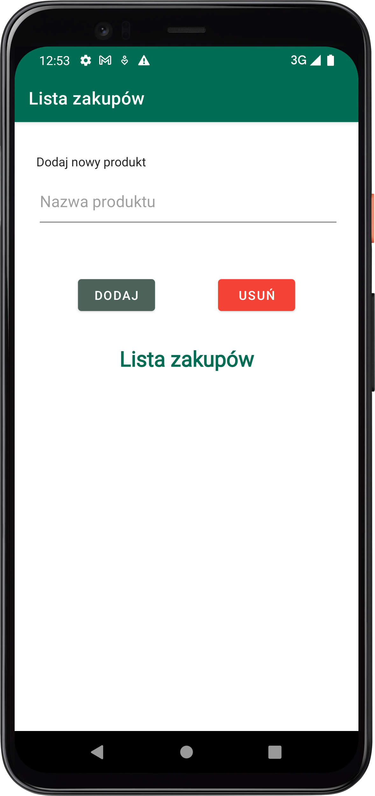
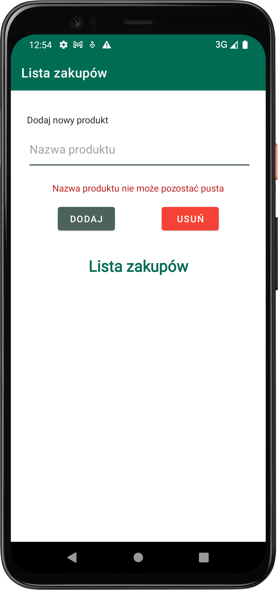
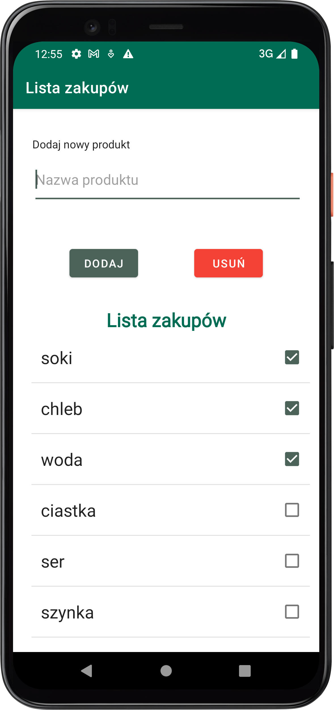

# Shopping List App
## Author: Michał Ryngier
## Subject: Nowoczesne Języki Programowania

### Description:

Projekt zaliczeniowy z przedmiotu Nowoczesne Języki Programowania. W ramach projektu zreazlizowana została aplikacja mobilna w języku Kotlin, której funkcjonalnością jest tworzenie listy zakupowej z możliwością dodawania nowych pozycji, usuwania oraz odznaczania wybranych elementów.

### Zrzuty ekranu:
#### Widok aplikacji

#### Obsługa błędu nazwy produktu

#### Dodane pozycje
